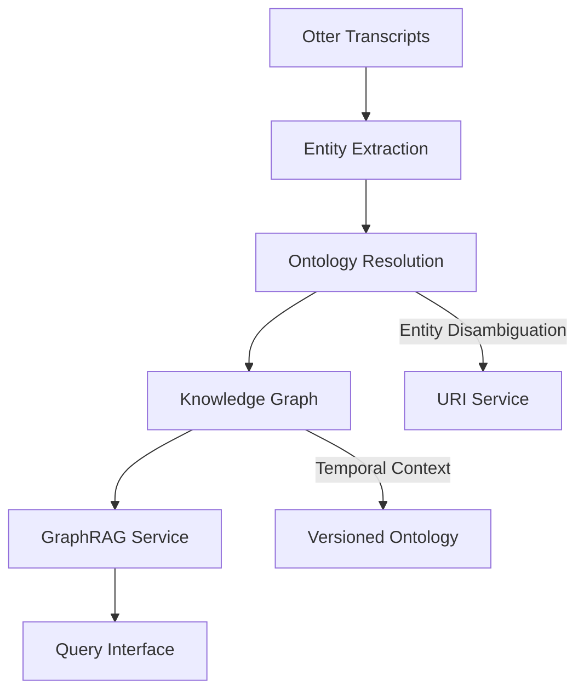

# Otter.ai Plugin for Eliza AI Framework

This plugin integrates Otter.ai functionality into the Eliza AI agent framework, allowing your agent to access and manage transcripts and meeting summaries from Otter.ai.

## Features

- **Transcript Retrieval**: Fetch and display transcripts from your Otter.ai account
- **Meeting Summary Access**: Access AI-generated summaries of your Otter.ai meetings
- **Search Functionality**: Search through transcripts for specific content
- **Context Provider**: Adds recent transcript information to the agent's context

## Prerequisites

- Node.js 14.x or higher
- A valid Otter.ai account

## Installation

1. Install the plugin in your Eliza AI agent project:

```bash
npm install eliza-plugin-otter
```

2. Add the plugin to your agent's configuration file:

```json
{
  "plugins": [
    "eliza-plugin-otter"
  ],
  "settings": {
    "OTTER_EMAIL": "your-email@example.com",
    "OTTER_PASSWORD": "your-password"
  }
}
```

## Usage

Once installed and configured, the plugin provides the following capabilities to your Eliza agent:

### Actions

1. **FETCH_OTTER_TRANSCRIPTS**: Retrieve transcripts from Otter.ai
   - List recent transcripts: "Show me my Otter.ai transcripts"
   - Get a specific transcript: "Get transcript for [ID]"
   - Search transcripts: "Search for [query] in my transcripts"
   - Analyze a transcript: "Reason about transcript [ID]"
   - Ask specific questions: "Reason about transcript [ID], what did they discuss about [topic]?"

2. **FETCH_OTTER_SUMMARY**: Retrieve meeting summaries from Otter.ai
   - List recent summaries: "Show me my Otter.ai meeting summaries"
   - Get a specific summary: "Get summary for [ID]"

### Context Provider

The plugin also includes a context provider that adds information about your recent Otter.ai transcripts to the agent's state, allowing it to reference your recent meetings when relevant to the conversation.

## Architecture

The Otter.ai plugin is built using a modular architecture that follows the Eliza AI agent framework's plugin structure. Here's a detailed explanation of each component:

### Project Structure

```
├── actions
│   ├── fetchTranscripts.ts     # Handles transcript retrieval and reasoning
│   ├── fetchMeetingSummary.ts  # Handles meeting summary retrieval
│   └── index.ts                # Exports all actions
├── constants.ts                # Defines constants used throughout the plugin
├── index.ts                    # Main plugin entry point
├── providers
│   ├── otterContextProvider.ts # Provides Otter.ai context to the agent
│   └── index.ts                # Exports all providers
├── routes
│   ├── health.ts               # Health check endpoint
│   └── index.ts                # Exports all routes
└── services
    ├── index.ts                # Exports OtterService
    ├── otterApi.ts             # API client for Otter.ai
    └── transcriptDbService.ts  # Service for storing and retrieving transcripts
```

### Components

#### Actions

Actions are the primary way users interact with the plugin. They define the capabilities that the agent can perform.

1. **fetchTranscripts**: Handles all transcript-related operations:
   - Listing all transcripts
   - Fetching a specific transcript by ID
   - Searching across transcripts
   - Reasoning about transcript content
   
   This action parses the user's request to determine which operation to perform, then calls the appropriate handler function. For large transcripts, it splits the response to prevent context window overflow and stores the transcript in the database for future reasoning.

2. **fetchMeetingSummary**: Retrieves AI-generated summaries of meetings from Otter.ai.

#### Services

Services handle the business logic and external API interactions.

1. **OtterService**: The main service that interacts with the Otter.ai API.
   - Handles authentication with Otter.ai
   - Retrieves transcripts and meeting summaries
   - Formats and processes the API responses
   - Manages caching for better performance
   - Interfaces with the TranscriptDbService for transcript storage and retrieval

2. **TranscriptDbService**: Handles storing and retrieving transcripts.
   - Stores formatted transcripts in a database (currently using runtime cache)
   - Retrieves stored transcripts for reasoning
   - Provides a consistent interface for transcript data access

3. **OtterApi**: Low-level API client that handles direct communication with the Otter.ai API.
   - Manages authentication tokens
   - Makes HTTP requests to the Otter.ai API
   - Handles API-specific error handling

#### Providers

Providers add contextual information to the agent's state.

1. **otterContextProvider**: Adds information about recent Otter.ai transcripts to the agent's context.
   - Retrieves recent transcripts from Otter.ai
   - Formats them into a context-friendly format
   - Adds them to the agent's state
   - This allows the agent to reference recent meetings in conversations

#### Routes

Routes expose HTTP endpoints for external interaction.

1. **health**: A simple health check endpoint that returns the status of the Otter.ai service.
   - Verifies that the plugin is running
   - Checks the connection to Otter.ai
   - Returns the status of the service

### Data Flow

1. User makes a request (e.g., "Get transcript for ABC123")
2. The request is routed to the appropriate action (fetchTranscripts)
3. The action parses the request and calls the appropriate handler
4. The handler uses the OtterService to retrieve data from Otter.ai
5. The OtterService formats the response and returns it to the handler
6. For transcript retrieval, the transcript is stored in the TranscriptDbService
7. The handler formats the response and sends it back to the user

For reasoning about transcripts:
1. User requests reasoning (e.g., "Reason about transcript ABC123")
2. The fetchTranscripts action calls the handleTranscriptReasoning handler
3. The handler checks if the transcript is in the database
4. If not, it fetches it from Otter.ai and stores it
5. The handler then retrieves the transcript from the database
6. The full transcript (or as much as fits within context limits) is sent to the LLM
7. The LLM analyzes the transcript and provides insights

For asking specific questions about transcripts:
1. User asks a specific question (e.g., "Reason about transcript ABC123, what did they discuss about project timelines?")
2. The fetchTranscripts action extracts both the transcript ID and the question
3. The handleTranscriptReasoning handler is called with both parameters
4. The transcript is retrieved from the database (or fetched and stored if not available)
5. The full transcript and the specific question are sent to the LLM
6. The LLM provides a targeted answer to the question based on the transcript content

### Building and Development

```bash
npm run build
```

To develop new features:
1. Identify which component needs to be modified
2. Make changes to the appropriate files
3. Test the changes by running the plugin
4. Build the plugin for production use

## Security Considerations

This plugin requires your Otter.ai credentials to function. These credentials are stored in your agent's configuration and are used to authenticate with Otter.ai. Ensure that your agent's configuration file is secure and not exposed to unauthorized users.

## Future Development

### Transcript Storage and Reasoning

A planned enhancement is to store processed transcripts in a database (PostgreSQL or similar) to enable more sophisticated reasoning capabilities:

- **Full Transcript Reasoning**: When a user asks to reason about a transcript, the system could retrieve the full transcript from the database and send as much as possible to the LLM within context window limits.
- **Chunking and Embedding**: Large transcripts could be automatically chunked and embedded for more efficient retrieval.
- **Contextual Analysis**: Enable deeper analysis of meeting content by maintaining the full context of conversations.

### GraphRAG Integration Roadmap

#### Architecture Overview


#### Implementation Phases

1. **Core Ontology Schema** (`v1.0`)
```typescript
// src/OtterPlugin/types.ts
interface GraphRAGConfig {
  ontologyVersion: string;
  entityResolutionThreshold: number;
  temporalContextDepth: number;
}
```

2. **Entity Resolution Service**
```typescript
// src/OtterPlugin/services/entityResolver.ts
class EntityResolver {
  constructor(
    private similarityThreshold = 0.85,
    private contextWindow = 3 // meetings to consider
  ) {}

  resolveTranscriptEntities(transcript: Transcript): ResolvedEntity[] {
    // Uses NLP to link entities across meetings
  }
}
```

3. **Graph Query Patterns**
```sparql
# Example hypothesis generation query
SELECT ?hypothesis ?confidence
WHERE {
  ?meeting :discussedTopic "protein folding" .
  ?participant :attendedMeeting ?meeting ;
               :affiliation ?org .
  ?org :researchFocus ?researchArea .
  BIND(CONCAT("Potential collaboration between ", ?org, 
        " on ", ?researchArea) AS ?hypothesis)
  BIND(0.85 AS ?confidence)
}
```

#### Key Features

- **Knowledge Graph Construction**: Build comprehensive knowledge graphs from transcript content
- **Semantic Relationship Mapping**: Connect entities, topics, and concepts across multiple meetings
- **Entity Disambiguation**: Develop sophisticated NLP techniques to resolve and link entities
- **Temporal Context Tracking**: Maintain versioned ontology to track entity evolution
- **Multi-hop Reasoning**: Enable cross-transcript insights and pattern recognition

#### Potential Applications

- Automated meeting insights generation
- Cross-meeting topic and relationship discovery
- Enhanced contextual understanding for AI agents
- Intelligent hypothesis generation from meeting data

This approach will transform how we extract and utilize information from meeting transcripts, providing unprecedented depth and connectivity in meeting analysis.

## License

MIT
