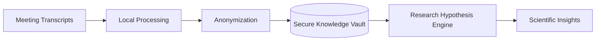

# Otter.ai Plugin for Eliza AI Framework

This plugin integrates Otter.ai functionality into the Eliza AI agent framework, allowing your agent to access and manage transcripts and meeting summaries from Otter.ai.

## Features

- **Transcript Retrieval**: Fetch and display transcripts from your Otter.ai account
- **Meeting Summary Access**: Access AI-generated summaries of your Otter.ai meetings
- **Search Functionality**: Search through transcripts for specific content
- **Context Provider**: Adds recent transcript information to the agent's context

## Prerequisites

- Node.js 14.x or higher
- A valid Otter.ai account

## Installation

1. Install the plugin in your Eliza AI agent project:

```bash
npm install eliza-plugin-otter
```

2. Add the plugin to your agent's configuration file:

```json
{
  "plugins": [
    "eliza-plugin-otter"
  ],
  "settings": {
    "OTTER_EMAIL": "your-email@example.com",
    "OTTER_PASSWORD": "your-password"
  }
}
```

## Usage

Once installed and configured, the plugin provides the following capabilities to your Eliza agent:

### Actions

1. **FETCH_OTTER_TRANSCRIPTS**: Retrieve transcripts from Otter.ai
   - List recent transcripts: "Show me my Otter.ai transcripts"
   - Get a specific transcript: "Get transcript for [ID]"
   - Search transcripts: "Search for [query] in my transcripts"
   - Analyze a transcript: "Reason about transcript [ID]"
   - Ask specific questions: "Reason about transcript [ID], what did they discuss about [topic]?"

2. **FETCH_OTTER_SUMMARY**: Retrieve meeting summaries from Otter.ai
   - List recent summaries: "Show me my Otter.ai meeting summaries"
   - Get a specific summary: "Get summary for [ID]"

### Context Provider

The plugin also includes a context provider that adds information about your recent Otter.ai transcripts to the agent's state, allowing it to reference your recent meetings when relevant to the conversation.

## Architecture

The Otter.ai plugin is built using a modular architecture that follows the Eliza AI agent framework's plugin structure. Here's a detailed explanation of each component:

### Project Structure

```
├── actions
│   ├── fetchTranscripts.ts     # Handles transcript retrieval and reasoning
│   ├── fetchMeetingSummary.ts  # Handles meeting summary retrieval
│   └── index.ts                # Exports all actions
├── constants.ts                # Defines constants used throughout the plugin
├── index.ts                    # Main plugin entry point
├── providers
│   ├── otterContextProvider.ts # Provides Otter.ai context to the agent
│   └── index.ts                # Exports all providers
├── routes
│   ├── health.ts               # Health check endpoint
│   └── index.ts                # Exports all routes
└── services
    ├── index.ts                # Exports OtterService
    ├── otterApi.ts             # API client for Otter.ai
    └── transcriptDbService.ts  # Service for storing and retrieving transcripts
```

[Rest of the existing README content remains the same...]

## Future Development

### Transcript Storage and Reasoning

A planned enhancement is to store processed transcripts in a database (PostgreSQL or similar) to enable more sophisticated reasoning capabilities:

- **Full Transcript Reasoning**: When a user asks to reason about a transcript, the system could retrieve the full transcript from the database and send as much as possible to the LLM within context window limits.
- **Chunking and Embedding**: Large transcripts could be automatically chunked and embedded for more efficient retrieval.
- **Contextual Analysis**: Enable deeper analysis of meeting content by maintaining the full context of conversations.

### Scientific Research Integration

#### Context Enrichment for Research Workflows



#### Key Research Integration Features

1. **Privacy-Preserving Context Sharing**
   - Local, encrypted storage of meeting transcripts
   - Anonymization of sensitive participant information
   - Secure, controlled access to research-relevant insights

2. **Hypothesis Augmentation**
   - Extract contextual keywords and entities from meetings
   - Provide supplementary information to existing research hypothesis generation systems
   - Maintain strict data privacy and consent protocols

3. **Workflow Integration**
   - Seamless connection with research management tools
   - Support for interdisciplinary collaboration
   - Minimal overhead for researchers

#### Implementation Roadmap

| Phase | Focus | Privacy Considerations |
|-------|-------|------------------------|
| 1 | Local Context Extraction | On-premise data processing |
| 2 | Secure Hypothesis Enrichment | Field-level encryption |
| 3 | Cross-Plugin Collaboration | Differential privacy techniques |

#### Technical Foundations

```typescript
interface SecureContextExchange {
  meetingID: string;
  anonymizedEntities: string[];
  encryptedKeywords: string;
  hypothesisRelevanceScore: number;
}
```

This approach transforms meeting transcripts from passive records into active research assets, enabling more dynamic and interconnected scientific discourse while maintaining the highest standards of data privacy and ethical research practices.

### GraphRAG Integration

[Existing GraphRAG section remains the same]

## License

MIT
